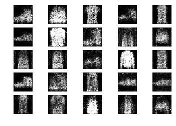
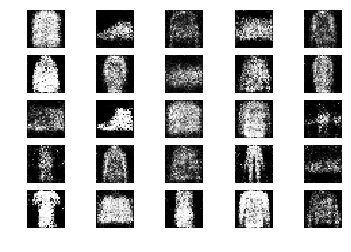

# Generative Adversarial Network on Fashion MNIST dataset

Generative Adversarial Networks (GANs) are a powerful class of neural networks that are used for unsupervised learning. It was developed and introduced by Ian J. Goodfellow in 2014. GANs are basically made up of a system of two competing neural network models which compete with each other and are able to analyze, capture and copy the variations within a dataset.

## Fashion MNIST

Fashion-MNIST is a dataset of Zalando's article images—consisting of a training set of 60,000 examples and a test set of 10,000 examples. Each example is a 28x28 grayscale image, associated with a label from 10 classes.

https://github.com/zalandoresearch/fashion-mnist

## Results
Epoch 200:

Epoch 800:

Epoch 2000:

Epoch 2900 (Last) :

## License
[MIT](https://choosealicense.com/licenses/mit/)